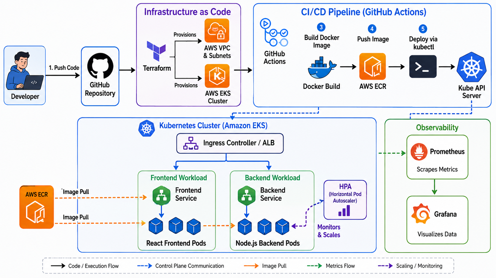

# Enterprise DevOps Implementation

This repository demonstrates a complete, production-ready DevOps deployment strategy for a cloud-native web application containing a React Frontend and a Node.js (Express) Backend.

This project showcases industry-standard tools and practices encompassing Containerization, Infrastructure as Code (IaC), Kubernetes Orchestration, Continuous Integration & Deployment (CI/CD), and Monitoring. It is built with a heavy emphasis on security, scalability, high availability, and operational excellence.

---

## 1. Architecture Overview & Best Practices

The architecture ensures zero-downtime deployments, rapid scaling, and robust security boundaries.

### Core Principles Applied:
- **Security:** Principle of least privilege is strictly adhered to. Containers run as non-root users, IAM roles are restricted, and Terraform state files are encrypted securely in remote S3 buckets.
- **Scalability:** Horizontal Pod Autoscaling (HPA) and Cluster Autoscaler are configured for dynamic traffic handling.
- **Reliability:** Multi-AZ (Availability Zone) deployments, readiness/liveness probes, and rolling updates with zero downtime.
- **Automation:** Everything as Code. No manual changes are allowed in production.

---

## 2. Containerization (Docker)

The application is containerized using Docker. All Dockerfiles utilize **multi-stage builds** to drastically minimize the final image size and reduce the attack surface. 

- **Backend:** Node.js Alpine images are used. Dependencies are installed deterministically using `npm ci`. The application process is executed by a restricted `node` user instead of the `root` user to prevent privilege escalation if a vulnerability is exploited.
- **Frontend:** A two-stage build compiles the static React assets in the first stage and serves them using a lightweight `nginx:alpine` image in the second stage.

---

## 3. Infrastructure as Code (Terraform & AWS EKS)

Infrastructure is provisioned entirely using Terraform, targeting AWS and Elastic Kubernetes Service (EKS).

- **Remote State:** State files are stored remotely in an S3 bucket with DynamoDB utilized for state-locking. This prevents concurrent modification collisions.
- **VPC & Networking:** A High Availability VPC is created utilizing the `terraform-aws-modules/vpc/aws` module spanning 3 Availability Zones, complete with public/private subnets and NAT Gateways.
- **EKS Cluster:** The `terraform-aws-modules/eks/aws` module is leveraged to spin up a production-ready Kubernetes 1.28 cluster with Managed Node Groups.

---

## 4. Container Orchestration (Kubernetes)

Kubernetes manifests are designed to handle traffic robustly. 

- **Deployments & Services:** Backend services are deployed with a `replica` count of 3 to ensure High Availability across nodes.
- **Probes:** `readinessProbe` and `livenessProbe` are configured for all pods to ensure the Kubernetes service load balancer only routes traffic to healthy application containers.
- **Resource Limits:** `requests` and `limits` for CPU and Memory are explicitly defined to prevent noisy-neighbor problems and node resource exhaustion.
- **HPA:** A `HorizontalPodAutoscaler` dynamically scales up pods when average CPU utilization hits 70%.

---

## 5. Continuous Integration & Deployment (CI/CD)

The repository implements a fully automated CI/CD pipeline utilizing **GitHub Actions**.

- Automatically triggers on pushes to the `main` branch.
- Securely authenticates with AWS using GitHub Secrets.
- Builds the Docker images, tags them dynamically using the Git SHA (`${{ github.sha }}`), and pushes them to Amazon ECR.
- Automatically substitutes the new image tag into the Kubernetes deployment manifests and executes a rolling deployment using `kubectl apply`.

---

## 6. Monitoring & Observability

To ensure complete visibility into the production environment:
- **Metrics:** `kube-prometheus-stack` (Prometheus & Grafana) is deployed via Helm to gather hardware and service-level metrics.
- **Logs:** Fluent Bit is configured as a DaemonSet to aggregate and forward all container logs into an OpenSearch/Elasticsearch cluster.
- **Alerting:** Alertmanager is configured to trigger notifications directly to PagerDuty or Slack in the event of pod crashes or node resource starvation.

---

## 7. Operational Troubleshooting Guide

When incidents occur, the following standard operating procedures (SOPs) are used to resolve them efficiently.

### 🔴 CrashLoopBackOff (Pod keeps restarting)
**Diagnosis:** Run `kubectl logs <pod-name> -p` to inspect the logs of the previous crashed instance. Common issues include missing ENV vars or DB connection failures.
**Resolution:** Rectify the issue in the code or ConfigMap, and run a rolling restart: `kubectl rollout restart deployment backend`.

### 🔴 ImagePullBackOff / ErrImagePull
**Diagnosis:** Run `kubectl describe pod <pod-name>` and inspect the Events block.
**Resolution:** Ensure the image tag exists in ECR and that the EKS worker nodes possess the correct IAM Instance Profile role to pull from the registry.

### 🔴 Pending Pods
**Diagnosis:** Run `kubectl get events --sort-by='.metadata.creationTimestamp'`. This usually signifies insufficient CPU or Memory in the cluster to schedule the pod.
**Resolution:** Scale up the EKS Node Group (or let Cluster Autoscaler handle it) or adjust the Pod's Resource Requests.

### 🔴 502 Bad Gateway / 503 Service Unavailable
**Diagnosis:** Validate if service endpoints exist via `kubectl get endpoints backend-service`.
**Resolution:** If endpoints are missing, the pods are failing their Readiness Probes. Inspect application logs. If endpoints exist, the issue likely resides with the Ingress Controller routing.
